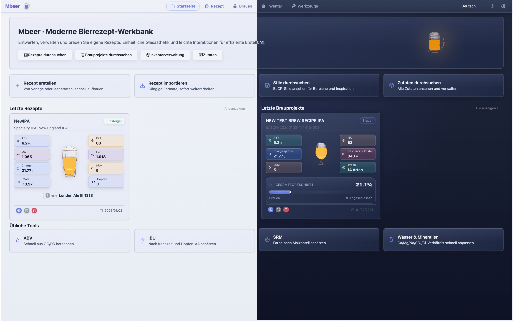
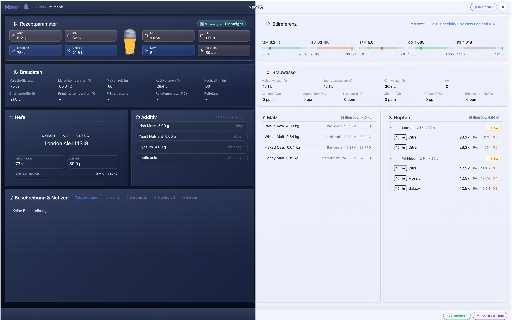
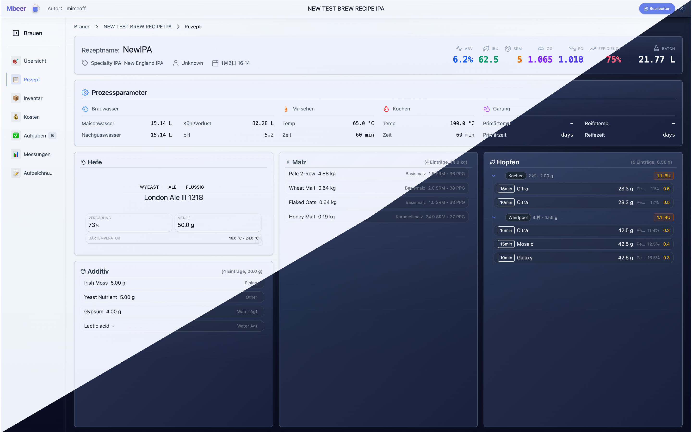
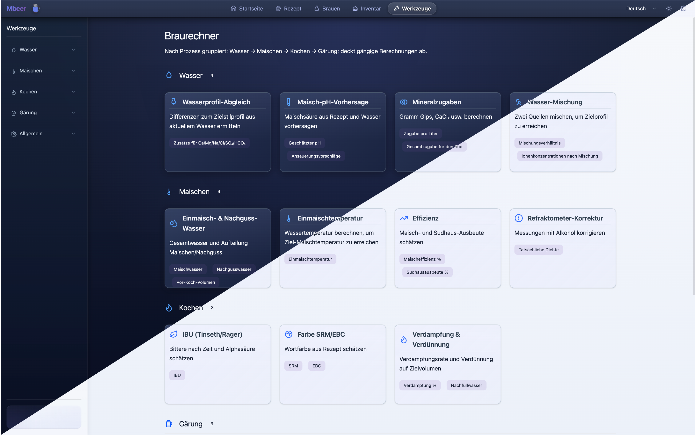

# Mbeer: Brauassistent für Craft Beer (Projektvorstellung)

Mbeer ist ein Local-first Tool für Craft-Beer-Fans und professionelle Brauer. Es kombiniert Rezeptentwicklung, Kennzahlenberechnung, lückenlose Prozessdokumentation und Visualisierung, damit Sie Zielwerte sicher treffen und erfolgreiche Sude zuverlässig reproduzieren können.

## Für wen ist das?

| Zielgruppe | Nutzen |
| --- | --- |
| Einsteiger im Heimbrauen | Strukturierte Aufzeichnung + Berechnungen, weniger Trial-and-Error |
| Fortgeschrittene | Schneller iterieren dank Echtzeit-Kennzahlen beim Anpassen von Rezepten |
| Profis / kleine Brauereien | Chargen nachvollziehbar dokumentieren und standardisieren |

## Kernfunktionen

| Bereich | Funktion | Mehrwert |
| --- | --- | --- |
| Rezeptdesign | BJCP-Stilrichtlinien; Echtzeit OG/FG/ABV/IBU/SRM | Änderungen sofort bewerten |
| Prozessverfolgung | Maischen/Kochen/Gärung/Reifung mit Zeit, Temperatur, Dichte | Konstanz erhöhen, Bestes wiederholen |
| Zutatenverwaltung | Malz/Hopfen/Hefe/Zusätze; eigene Zutaten möglich | Lager im Blick behalten, Wissen aufbauen |
| Datenvisualisierung | Diagramme zu Gärverlauf, Bestand, Kosten | Prozesse datenbasiert optimieren |
| Privatsphäre | Lokale Speicherung; offline nutzbar | Rezepte bleiben auf dem Gerät |
| Sprachen | Deutsch / Englisch / Chinesisch / Französisch | Bessere Zusammenarbeit international |

## Stichwörter

craft beer, brauen, rezept, rechner, heimbrauer, hopfen, malz, hefe, BJCP

## Screenshots (de-DE)

|  |  |  |
| --- | --- | --- |
|  |  |  |
|  |  |  |

## Links

- Repository: https://github.com/mimeoff/MBeer
